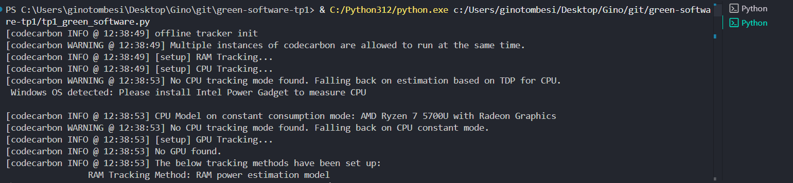

# TP1 – Conciencia en el código (Green Software)


- **Alumno:** Gino Paolo Tombesi
- **Legajo:** 95345  
- **Asignatura:** Green Software 4k4 2025 — Trabajo Práctico Nº1 (segunda alternativa)
- **Profesor:** Ingeniero Franco Mana  
- **Fecha:** 2025-09-03

---

## Objetivo
Medir potencia, energía y emisiones de CO₂e asociadas a la ejecución de un algoritmo en Python utilizando la librería CodeCarbon en modo *offline*, y comparar el cálculo de emisiones con un factor de emisión (FE) fijo provisto por la consigna.

**Metodología.**
1. Se armó el script con `OfflineEmissionsTracker` de CodeCarbon (intervalo de muestreo: 1 s).  
2. Se ejecutó el algoritmo **Criba de Eratóstenes** para `N = 50,000,000`.  
3. Se tomaron del CSV de CodeCarbon las métricas clave: `cpu_power`, `gpu_power`, `ram_power`, `energy_consumed`, `duration`, `emissions`.  
4. Se calculó además:  
   - Potencia promedio derivada de energía: P = Energía (Wh)/ Duración (h).  
   - Emisiones con FE fijo: Emisiones [tCO₂e] = Energía [MWh] * FE [tCO₂e/MWh].

**Entorno de ejecución.**
- SO: Windows 11 (10.0.26100)  
- Python: 3.12.3  
- CodeCarbon: 3.0.4  
- CPU: AMD Ryzen 7 5700U with Radeon Graphics — *modo constante (fallback)*  
- RAM disponible: 23.326 GB  
- GPU: no  
- Archivo de salida: `cc_logs/emissions.csv`

**Dependencias.**
```bash
pip install "codecarbon>=3.0.4"
```

---

## Código fuente

El script principal es **`tp1_green_software.py`**. Contiene:

- Implementación de la *Criba de Eratóstenes* (O(n log log n) tiempo, O(n) memoria).
- Estructuras para leer el CSV de CodeCarbon y consolidar métricas.
- Un reporte formateado en consola con tiempos, potencias, energía y emisiones (CodeCarbon vs. FE fijo).

**Ejecución (ejemplos).**
```bash
# Valores por defecto equivalentes a la corrida reportada
python tp1_green_software.py --n 50000000 --fe 0.26 --country ARG --interval 1 --reps 1

# Variar parámetros
python tp1_green_software.py --n 10000000 --fe 0.26 --country ARG --interval 2 --reps 3
```

**Parámetros principales.**
- `--n`: cota superior para la criba (por defecto: 50,000,000).  
- `--fe`: factor de emisión en tCO₂e/MWh (por defecto: 0.26).  
- `--country`: ISO-3 del país para CodeCarbon offline (por defecto: ARG).  
- `--interval`: intervalo de muestreo de potencia en segundos (≥1).  
- `--reps`: repeticiones del algoritmo (para aumentar la carga).

**Salidas.**
- Consola: reporte con *duración, energía, potencias* y *emisiones* (CodeCarbon y FE fijo).  
- CSV: `cc_logs/emissions.csv` con columnas estándar de CodeCarbon.

---

## Resultados
**Imagenes de la consola cuando se corrio**



**Contexto de la corrida reportada.**
- Algoritmo: Criba de Eratóstenes  
- Parámetros: `N = 50,000,000`, `country = ARG`, `FE = 0.26 tCO₂e/MWh`, `interval = 1 s`, `reps = 1`  
- Primos encontrados: **3,001,134**

**Métricas principales (según tracker).**
- **Duración:** 7.616 s  
- **Energía total:** 0.000263 kWh (≈ **946.8 J**)  
- **Potencias (promedio CodeCarbon):** CPU **120.00 W**, GPU **0.00 W**, RAM **10.00 W**, **Total 130.00 W**  
- **Potencia promedio derivada de energía:** **124.37 W**

**Cálculo de emisiones.**
- Con **FE fijo Argentina** (0.26 tCO₂e/MWh): **0.000068 kgCO₂e** (**0.068 g**)  
- **Estimación CodeCarbon** (ARG offline): **0.000093 kgCO₂e** (**0.093 g**)

> Diferencia aproximada: 0.025 g CO₂e por corrida (CodeCarbon > FE fijo), esperable por los modelos y factores propios de la librería en modo offline.


---

## Primera conclusión

La medición muestra un **consumo energético muy pequeño** para una corrida aislada (≈0.000263 kWh), que se traduce en emisiones del orden de **centésimas de gramo de CO₂e** (0.068–0.093 g), convergentes entre el cálculo con **FE fijo** y la **estimación de CodeCarbon**. La ligera diferencia se explica por el **modelo de potencia de fallback** en CPU y por los **factores regionales internos** de la librería en modo offline.

## Compensación por árbol — horas de procesamiento equivalentes

Usando la **duración y las emisiones de la corrida reportada** (duración = **7.616 s**; emisiones por corrida: **FE fijo = 0.000068 kgCO₂e** ; **CodeCarbon = 0.000093 kgCO₂e**).

### Cálculo (fórmula)
- Duración en horas:  
  t_h = 7.616 / 3600 = 0.0021156 horas
- Emisión por hora:  
  emision_h = emisión por corrida (kg) / tiempo_h
- Horas compensadas por un árbol (por año):  
  horas = absorción del árbol (kg/año) / emision_h

### Resultados numéricos

**1) Árbol joven — ~30 kg CO₂/año**
- Usando **FE fijo (0.000068 kg por corrida)**:  
  emision_h = 0.000068 kg / 0,002115 h = 0.032142 kg/h (32,142 g/h.)

  Emisión ≈ **0.03214 kg/h** (≈32.14 g/h) → **≈ 933.33 horas** ≈ **38.9 días** ≈ **0.107 años**.
- Usando **CodeCarbon (0.000093 kg por corrida)**:  
   emision_h = 0,000093 kg​ / 0,002115 h = 0,043960 kg/h (43,960 g/h)

  Emisión ≈ **0.04396 kg/h** (≈43.96 g/h) → **≈ 682.44 horas** ≈ **28.4 días** ≈ **0.078 años**.

**2) Árbol adulto — ~300 kg CO₂/año**
- Usando **FE fijo**: **≈ 9333.3 horas** ≈ **389 días** ≈ **1.07 años**.
- Usando **CodeCarbon**: **≈ 6824.4 horas** ≈ **284.3 días** ≈ **0.78 años**.

## Interpretación de los calculos
- Un solo **árbol joven (30 kg/año)** compensa aproximadamente **28–39 días** de ejecución continua de este algoritmo al año, según los resultados calculados
- Un **árbol adulto (300 kg/año)** compensa aproximadamente **0.78–1.07 años** de ejecución continua — es decir, **casi todo un año** de procesamiento continuo en la mayor estimación.

## Conclusion
- Estas cifras **asumen escala lineal**: se supone que cada hora de procesamiento repite el mismo perfil de consumo medido en la corrida (mismo hardware, mismas condiciones). No se incluyen emisiones embebidas (fabricación de hardware), transporte, ni variaciones de la intensidad de carbono de la red a lo largo del tiempo.  
- Una corrida aislada de la criba produce fracciones de gramo de CO₂e, pero al escalar a operación continua la huella se vuelve significativa: un único árbol adulto podría compensar aproximadamente un año de ejecución continua de este algoritmo. Por tanto, para reducir impacto real conviene combinar: (a) optimización algorítmica para reducir tiempo de CPU, (b) ejecutar menos repeticiones, y (c) preferir energía con baja intensidad de carbono o comprar bonos de carbono para ejecutar el algoritmo mucho tiempo.


## Licencias y referencias

- Criba de Eratóstenes (implementación base, MIT): <https://github.com/aditya5558/Sieve-of-Eratosthenes>  
- CodeCarbon — parámetros, salida y metodología:  
  - <https://mlco2.github.io/codecarbon/parameters.html>  
  - <https://mlco2.github.io/codecarbon/output.html>  
  - <https://mlco2.github.io/codecarbon/methodology.html>
